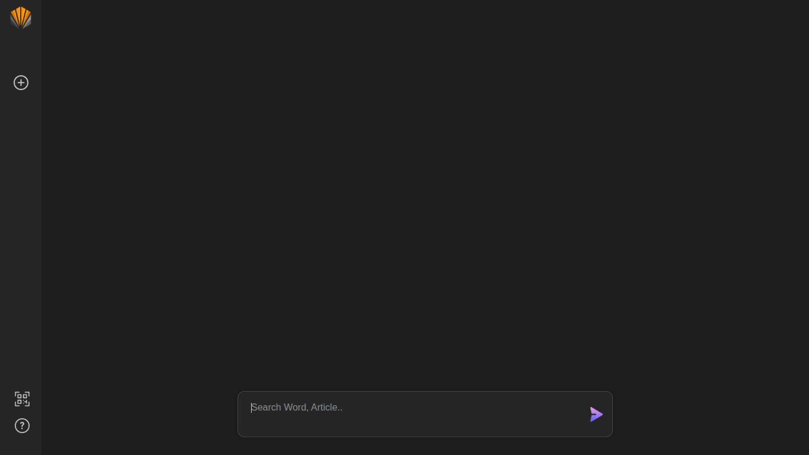
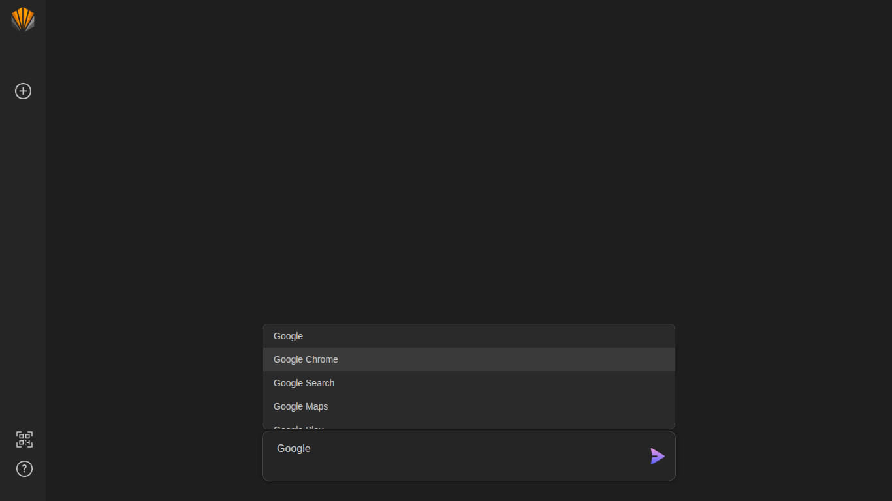
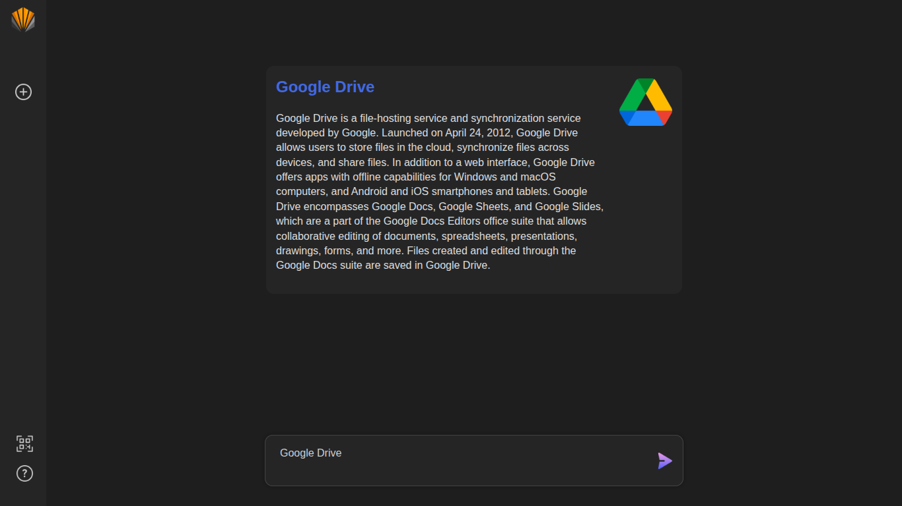

# 🧠 MisnDoow

> Explore knowledge instantly with **MisnDoow** — a sleek, dark-themed Wikipedia browser.

---

## 🌐 Overview

**MisnDoow** is a lightweight web application that allows users to quickly search and explore Wikipedia content in a modern, dark-themed interface. It focuses on simplicity, speed, and a distraction-free reading experience.

---

## ✨ Features

- 🔍 Instant Wikipedia search  
- 🌙 Modern dark-themed UI  
- ⚡ Fast and lightweight performance  
- 📖 Clean article preview layout  
- 📱 Fully responsive design  
- 🧭 Simple and smooth navigation  

---

## 🛠️ Tech Stack

- HTML5  
- CSS3  
- JavaScript (Vanilla JS)

---

## 📸 Screenshots

> Add your project screenshots inside the `assets/` folder and update the paths below.

### 🏠 Home Page


### 🔍 Search Results


### 📖 Article View


---

## 📁 Project Structure

```yaml
misndoow-app:
  index.html: "Main homepage"
  help.html: "Help/support page"
  style.css: "Main styling"
  help.css: "Help page styling"
  script.js: "App logic (Wikipedia API handling)"
  assets: "Images/icons + screenshots"
  README.md: "Project documentation"